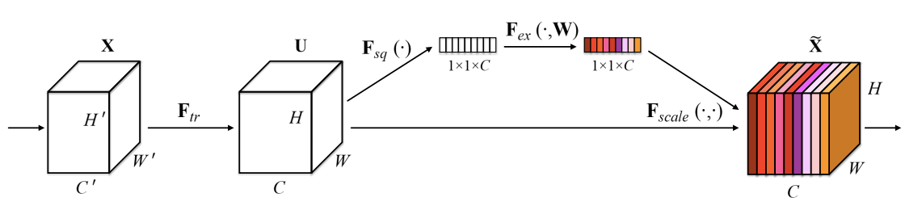

# Summaries of image classification papers

## VGG
[Very Deep Convolutional Networks for Large-scale Image Recognition](https://arxiv.org/pdf/1409.1556.pdf)

Lorem ipsum dolor sit amet, consectetur adipiscing elit. Duis tempor sit
amet metus eget vestibulum. Quisque sit amet enim non odio ullamcorper
cursus. Mauris fermentum ultrices tortor, eu condimentum elit tempor et.
Etiam mi lacus, imperdiet vitae tristique vel, volutpat sit amet dolor.
Morbi eros ante, accumsan vitae ante vitae, efficitur posuere arcu. Nunc
vitae rutrum justo. Sed eget felis iaculis, sodales dui at, tempus
nulla. Curabitur nunc ligula, sodales quis aliquam non, auctor eget
nisl. Praesent tincidunt finibus mauris accumsan maximus.

[VGG16 Architecture](vgg16.png)
<!--  -->

## ResNet
[Deep Residual Learning for Image Recognition](https://arxiv.org/pdf/1512.03385.pdf)

The deep residual neural network from the Microsoft Research achieved 1st place  in ILSVRC 2015 for image classification. By 2015 neural network trend was to increase depth in models, so the authors ask themselves if getting better accuracy is only a matter of adding more layers. They found out that at some point in depth, accuracy gets saturated and then decreases.

In order to solve this issue, they proposed ResNet. This network main idea was to build a very deep net using residual connections to ease the training of deeper layers. Due to its very deep architecture it would be able to achieve high accuracy. The main architecture of ResNets is based on concatenating two main blocks:
  - Building Block: a couple of  3x3 convolutional layers followed by a feedforward connection to the block input. Main block for building deep architectures. Several building blocks are stacked in order to add depth to the network
  - Bottleneck Block: a 1x1 conv filter followed by a 3x3 and another 1x1 with a feedforward connection to the input. This block acts a bottleneck and allows the net to be trained on a feasible time.

Using feedforward connection that bypass layers each block no longer tries to learn the model directly, but the residuals (distance between actual and predicted) instead.

Adding a new building block (to make a model deeper), feedforward connection between the input of a block and its output calculates identity function and ensures that at least we can keep the same accuracy as we had before: it is easy for a block to learn zero-weights. This way every building block added get an equal or better accuracy than before.

The feedforward connection between the input of a block and its output allowed them to train those nets properly. When comparing a ResNet with its corresponding plain net (without residual connection), the improvements of the residual connection are more significant when the network to train is deeper. 

As a conclusions of their experiment, the best results on ImageNet were achieved with a 152 layer ResNet. This architecture outperformed VGG15/19 having a lower computational complexity. Deeper networks with over 1000 layers were also tested on CIFAR 10 image set. However, these deeper networks had a lower accuracy than shallower networks probably due to overfitting. CIFAR 10 image set is a relatively small dataset and makes it difficult for a very deep net with a huge amount of parameters to generalize well (the net is memorizing the train set). 

[ResNet50 architecture](resnet50.png)

## SEnet
[Squeeze-and-Excitation Networks](https://arxiv.org/pdf/1709.01507.pdf)

SEnet introduces the concept of Squeeze and Excitation blocks which builds on top of traditional convolutional ones and significantly improves their performance at nearly no cost. The main idea is to add a new level of flexibility to traditional convolutional layers by enabling the dynamic adaptation of the weights of each feature map through the use of few parameters (1% more than conventional blocks) with the aim to give more importance to relevant features and less to irrelevant ones.

Particularly, a SEnet block (visually in figure a)) takes as input a 3D tensor (width x height x num_channels) and computes a global understanding of each channel by using a global average pooling through the spatial dimensions (width x height), obtaining a 1 x 1 x num_channels output vector. This vector is then passed through a first fully-connected layer with a RELU activation function to add the necessary non-linearities and its complexity (number of output channels) is reduced by a ratio (the authors employed ratio=16), reducing the overall number of parameters. Next, a second FC layer with a sigmoid activation gives a smooth gating function (bounded) which encodes the relative importance of each channel. Finally, each original feature map is multiplied by the output of the “side” network (SEnet module) to obtain the SEnet block’s output.

Thanks to its simplicity, SEnet blocks can be added to any traditional CNN by just replacing the conventional convolutional block by its SEnet equivalent. In the paper (see figure b) below), the authors evaluated ResNet50 with SE blocks (SE-ResNet50) and obtained a similar performance to ResNet101 which has twice as many parameters.

<i> a) SEnet block </i>

 <i> b) Module comparison: ResNet vs SE-ResNet equivalent </i> 

