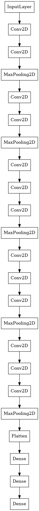

# Summaries of image classification papers

## VGG
[Very Deep Convolutional Networks for Large-scale Image Recognition](https://arxiv.org/pdf/1409.1556.pdf)

Lorem ipsum dolor sit amet, consectetur adipiscing elit. Duis tempor sit
amet metus eget vestibulum. Quisque sit amet enim non odio ullamcorper
cursus. Mauris fermentum ultrices tortor, eu condimentum elit tempor et.
Etiam mi lacus, imperdiet vitae tristique vel, volutpat sit amet dolor.
Morbi eros ante, accumsan vitae ante vitae, efficitur posuere arcu. Nunc
vitae rutrum justo. Sed eget felis iaculis, sodales dui at, tempus
nulla. Curabitur nunc ligula, sodales quis aliquam non, auctor eget
nisl. Praesent tincidunt finibus mauris accumsan maximus.

[VGG16 Architecture](vgg16.png)
<!--  -->

## ResNet
[Deep Residual Learning for Image Recognition](https://arxiv.org/pdf/1512.03385.pdf)

Lorem ipsum dolor sit amet, consectetur adipiscing elit. Duis tempor sit
amet metus eget vestibulum. Quisque sit amet enim non odio ullamcorper
cursus. Mauris fermentum ultrices tortor, eu condimentum elit tempor et.
Etiam mi lacus, imperdiet vitae tristique vel, volutpat sit amet dolor.
Morbi eros ante, accumsan vitae ante vitae, efficitur posuere arcu. Nunc
vitae rutrum justo. Sed eget felis iaculis, sodales dui at, tempus
nulla. Curabitur nunc ligula, sodales quis aliquam non, auctor eget
nisl. Praesent tincidunt finibus mauris accumsan maximus.

[ResNet50 architecture](resnet50.png)

## SEnet
[Squeeze-and-Excitation Networks](https://arxiv.org/pdf/1709.01507.pdf)

Lorem ipsum dolor sit amet, consectetur adipiscing elit. Duis tempor sit
amet metus eget vestibulum. Quisque sit amet enim non odio ullamcorper
cursus. Mauris fermentum ultrices tortor, eu condimentum elit tempor et.
Etiam mi lacus, imperdiet vitae tristique vel, volutpat sit amet dolor.
Morbi eros ante, accumsan vitae ante vitae, efficitur posuere arcu. Nunc
vitae rutrum justo. Sed eget felis iaculis, sodales dui at, tempus
nulla. Curabitur nunc ligula, sodales quis aliquam non, auctor eget
nisl. Praesent tincidunt finibus mauris accumsan maximus.

[a) SEnet block](SEnet_block.png), 
[b) Module comparison: ResNet vs SE-ResNet equivalent](ResNetmod_SEnetmod.png)
