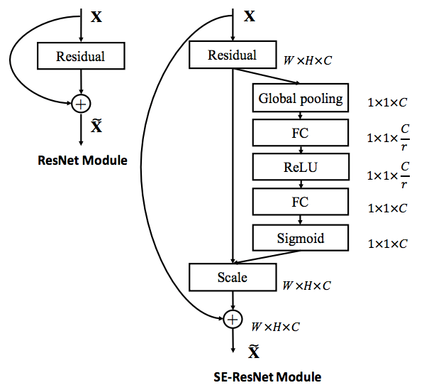

# Summaries of image classification papers

## VGG
[Very Deep Convolutional Networks for Large-scale Image Recognition](https://arxiv.org/pdf/1409.1556.pdf)

The convolutional neural network from the Visual Geometry Group (VGGNet) won the first place for image localisation and the second for image classification tracks in the ImageNet Challenge 2014 (ILSVRC 2014). In classification it achieved a top-5 test error of 7.3% on submission, quite close to the winner, GoogLeNet with a 6.7%. In posterior studies they got a 6.8% of top-5 error with a more simple system than others.

The architecture could be simply expressed as a stack of 3x3 conv layers with increasing number of filters, using five max-poolings with non-overlapping windows of 2x2, plus, two Fully Connected layers for regression and one for classification. The model that won is as deep as 16 weight layers, known as VGG16.

The main key of this network is to use only 3x3 filters. In order to keep the same receptive field as bigger filters, they stack several filters, increasing the receptive field each step. This have various consequences. First of all and most obvious is that stacking filters the network goes deeper. Not only that, each filter adds a non-linearity which makes the decision function more discriminative. Secondly, the number of parameters needed to express this function is less. As an example, to achieve the same receptive field of a 7x7 filter an stack of three 3x3 filters is needed, but the number of parameters are only the 19%. To avoid losing spatial resolution a padding of 1 is used in each conv. layer.

In order to train the network, the authors proposed two methods to initialize its weights. At first, the weights were initialized by training a shallower net and transferring the weights to the larger net. Intuitively it appears to be a good solution as the train is being trained sequentially. As a second attempt to train the network, they used Glorot's weight initialization. By using this procedure, they achieved similar results with an smaller training time than using a smaller network. When training, they also explored the use of basic data augmentation to generate artificial images, increasing the amount of images on the image set. The main techniques consisted in random cropping, scaling, horizontal flipping and RGB shifting.

The final network outperformed in accuracy the networks proposed on previous years and was competitive with respect to GoogLeNet, the ImageNet Challenge 2014 winner in image classification. As a conclusion from their experiments, they found out the accuracy could be increased by increasing the depth of the neural network, when the network is trained properly.

[VGG16 Architecture](vgg16.png)

## ResNet
[Deep Residual Learning for Image Recognition](https://arxiv.org/pdf/1512.03385.pdf)

The deep residual neural network from the Microsoft Research achieved 1st place in ILSVRC 2015 for image classification. By 2015 neural network trend was to increase depth in models, so the authors ask themselves if getting better accuracy is only a matter of adding more layers. They found out that at some point in depth, accuracy gets saturated and then decreases.

In order to solve this issue, they proposed ResNet. This network main idea was to build a very deep net using residual connections to ease the training of deeper layers. Due to its very deep architecture it would be able to achieve high accuracy. The main architecture of ResNets is based on concatenating two main blocks:

  - Building Block: a couple of 3x3 convolutional layers followed by a feedforward connection to the block input. Main block for building deep architectures. Several building blocks are stacked in order to add depth to the network.
  - Bottleneck Block: a 1x1 conv filter followed by a 3x3 and another 1x1 with a feedforward connection to the input. This block reduces the number of parametrs, acting as a _bottleneck_, and allows the net to be trained on a feasible time.

Using feedforward connection that bypass layers, blocks are not longer trying to learn the model directly, but the residuals  instead. This residuals are the distances between actual and predicted output.

Adding a new building block, so making a model deeper, a feedforward connection is placed between the input of a block and its output. This connection calculates identity function and ensures that at least we can keep the same accuracy as we had before: it is easy for a block to learn zero-weights. As a consequence, every building block added gets an equal or better accuracy than before.

The feedforward connection, between the input of a block and its output, allowed the nets to train properly. When comparing a ResNet with its corresponding _plain net_, without residual connection, the improvement of the residual connection is more significant as the network is deeper.

As a conclusions from their experiment, the best results on ImageNet were achieved with a 152-layer ResNet. This architecture outperformed VGG15/19 while having a lower computational complexity. Deeper networks with over 1000 layers were also tested on CIFAR 10 image set. However, these deeper networks had lower accuracy probably due to overfitting. We have to consider that CIFAR 10 image set is a relatively small dataset and makes it difficult for a very deep net, with a huge amount of parameters, to generalize well. The network is basically memorizing the train set.

[ResNet50 architecture](resnet50.png)

## SEnet
[Squeeze-and-Excitation Networks](https://arxiv.org/pdf/1709.01507.pdf)

SEnet introduces the concept of Squeeze-and-Excitation blocks which builds on top of traditional convolutional blocks and significantly improves their performance at nearly no cost. The main idea is to add a new level of flexibility to traditional convolutional layers by enabling the dynamic adaptation of the weights, of each feature map, through the use of few parameters (1% more than conventional blocks). It is aimed to give more importance to relevant features and less to irrelevant ones.

Particularly, a SEnet block ([Fig. a](#figA)) takes as an input a 3D tensor (`Width x Height x Num of channels`) and computes a global understanding of each channel. This is done by using a global average pooling through the spatial dimensions (`Width x Height`), obtaining a `1 x 1 x Num of channels` output vector. This vector is then passed through a  fully-connected layer with a RELU activation function to add the necessary non-linearities. Its complexity, number of output channels, is reduced by a ratio of 16, reducing the overall number of parameters. Next, a second FC layer with a sigmoid activation gives a smooth gating function (bounded) which encodes the relative importance of each channel. Finally, each original feature map is multiplied by the output of a _side_ network, a SEnet module, to obtain the SEnet block's output.

Thanks to its simplicity, SEnet blocks can be added to any traditional CNN by just replacing the conventional convolutional blocks by its SEnet equivalent. In the paper ([Fig. b](#figB)), the authors evaluated ResNet50 with SE blocks, called SE-ResNet50, to obtain a similar performance than ResNet101, which has twice as many parameters.

<a name="figA">
<i> a) SEnet block </i>

<a name="figB">
 <i> b) Module comparison: ResNet vs SE-ResNet equivalent </i> 

