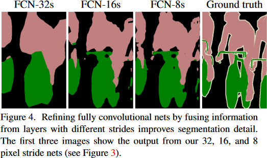
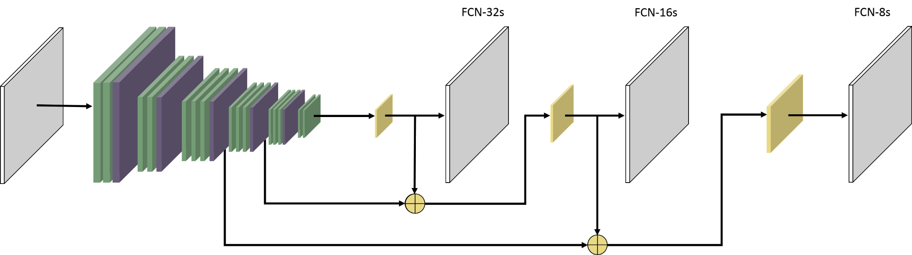
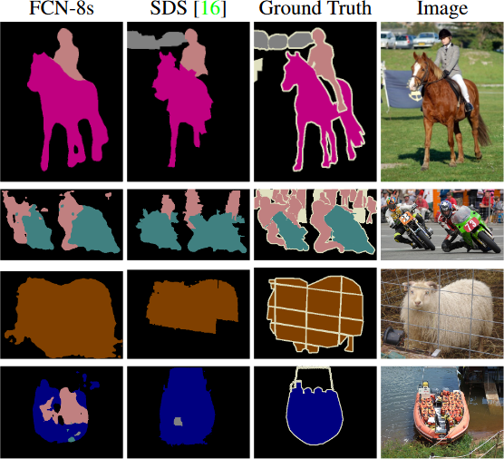
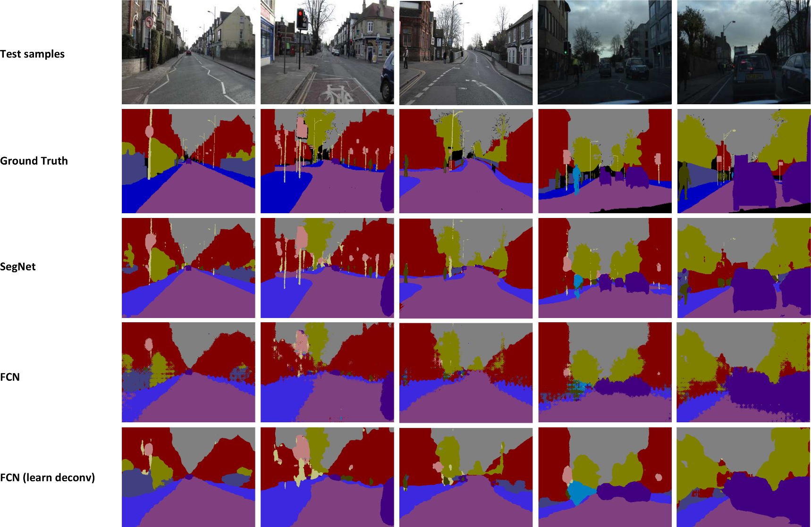

# Summaries of image segmentation papers

## FCN
[Fully Convolutional Networks for Semantic Segmentation](https://arxiv.org/abs/1411.4038)

A Fully Convolutional Network (FCN) could be seen not as a network by itself, but as a  modification of other network. The main idea is to transform the given network’s layers into convolutional layers. The original paper shows experiments with AlexNet, GoogLeNet and VGG16 being this latter the one which best performs. 

In more detail, first they “decapitate” the network removing the classification layer. Afterwards all the fully connected layers (FC) are converted to convolutional ones, keeping the number of channels but extending it for every “pixel”. For instance, if a FC has *d*  parameters, namely it is a *1 x d* dimensional array then is converted to a *h x w x d* array. These *h* and *w* are design parameters as any regular conv layer.
Subsequently a conv layer of size *h x w x k*, being *k* the number of classes, is appended to the network. This provides a coarse classification scores. Lastly, an upsampling stage which yields an equally sized output than the input image is appended, turning the coarse prediction into a dense prediction. 
The upsampling is done by fractionally strided convolutions, also called transposed convolutions or informally “deconvolutions”. This technique offers and end-to-end training

Only doing that, the semantic segmentation if quite coarse [Fig. a](#fcn_refinement). Therefore a refinement strategy is proposed to improve spatial precision. The strategy is to append those coarse predictions and upsampling stages on different layers of the network [Fig. b](#fcn_net), taking advantage of the implicit hierarchy of receptive fields in consecutive conv layers. As earlier layers are combined the spatial precision is increased [Fig. a](#fcn_refinement). The authors exposed that using more than 3 layers of predictions is not worthy due to a low further improvement and an increasing complexity.

<a name="fcn_refinement">
<i> a) FCN refining prediction map with lower layers </i>

<a name="fcn_net">
<i> b) FCN network </i>

The results are quite better than the state-of-the-art of the moment, like SDS. Compared with SDS, the authors reported an inference time is 286 times lower and it has a +20% in mean IU on PASCAL VOC2011/12 datasets. Also, training is 5 times faster than AlexNet on a GPU. They fine-tuned the networks of the experiment to leverage the already trained filters. Neither class balancing nor data augmentation is proposed in the original paper. 

To sum up, the network is able to recover fine structures, to separate closely interacting objects and it is robust to occluders [Fig. c](#fcn_vs_sds).

<a name="fcn_vs_sds">
<i> c) Comparison between FCN and SDS </i>

An official implementation on Caffe is publicly [available in GitHub](https://github.com/shelhamer/fcn.berkeleyvision.org)

## SegNet
[A Deep Convolutional Encoder-Decoder Architecture for Image Segmentation](https://arxiv.org/abs/1511.00561)

SegNet is a fully convolutional network with an encoder-decoder architecture [Fig. d](#segnet_net_original). It is based on VGG16, in fact the encoder is topologically identical to the VGG16’s 13 conv layers. As it is a fully convolutional net, the authors removed the FC layers which reduces the number of parameters up to a 10%.

<a name="segnet_net_original">
<i> d) SegNet architecture </i>

The encoder is a serie of blocks of convolutional layers, with *batch normalization*, plus *ReLU* and a *2x2* *max-pooling*. All the filters are of size *7x7* which provides a wide context for smooth labelling. From the max-pooling, the indices where its value are max are stored for future use in the decoder. This has a really small memory footprint (each index can be encoded with 2 bits, when using a *2x2* filter size).

On the other hand, the decoder is a serie of blocks of upsampling, convolutions and batch normalizations operations. The upsampling is a non-linear non-trainable operation which uses the stored indices to output an sparse n-dim array. Then this n-dim array is densified using convolutions which filters are initialized using bilinear interpolation weights. Afterwards, a soft-max classifier is appended to extract pixel-class probabilities. Finally, the segmentation is done using the max probable class per each pixel.

They are quite thoroughly in details about different experiments. As a sum up, their conclusions are that having learnable decoders is necessary for segmentation, that using indices instead of other techniques boost the inference time, that having a larger model than FCN provides a better fitted model on training, that in general is good for the performance to have information flowing from the encoder to the decoder, specially for the semantic contour measure *boundary F1-measure* (BF). They also state that SegNet is a good choice when there is a compromise between storage cost, accuracy versus inference time. 

As it is based on VGG16, the encoder is initialized with pre-trained weights from large datasets. The authors asses the net with [CamVid dataset](http://mi.eng.cam.ac.uk/research/projects/VideoRec/CamVid/) and [SUN RGB-D](http://rgbd.cs.princeton.edu), using SGD and end-to-end. The first dataset contains outdoor images captured from a moving car, the second images from furnished rooms in RGB along with depth channel. However depth is not used on the experiments.

For CamVid, an extract of the results comparing FCN with SegNet can be seen in (Fig. e)[#segnet_vs_fcn_on_camvid].

<a name="segnet_vs_fcn_on_camvid">
<i> e) SegNet vs FCN on CamVid dataset </i>

An official implementation on Caffe is publicly [available in GitHub](https://github.com/alexgkendall/caffe-segnet)
